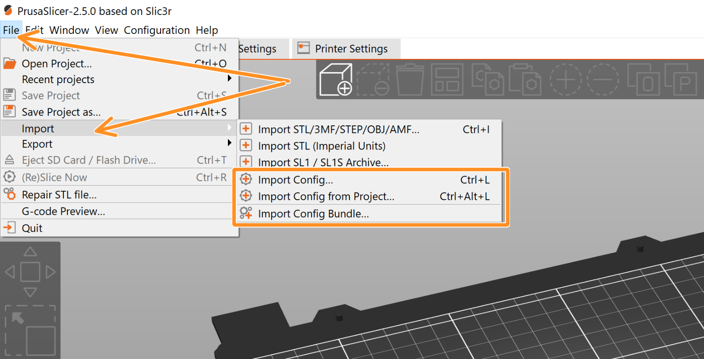
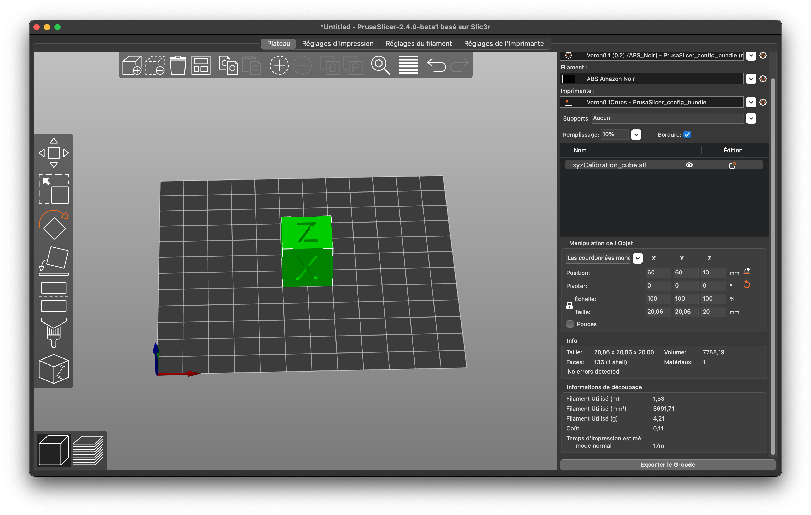
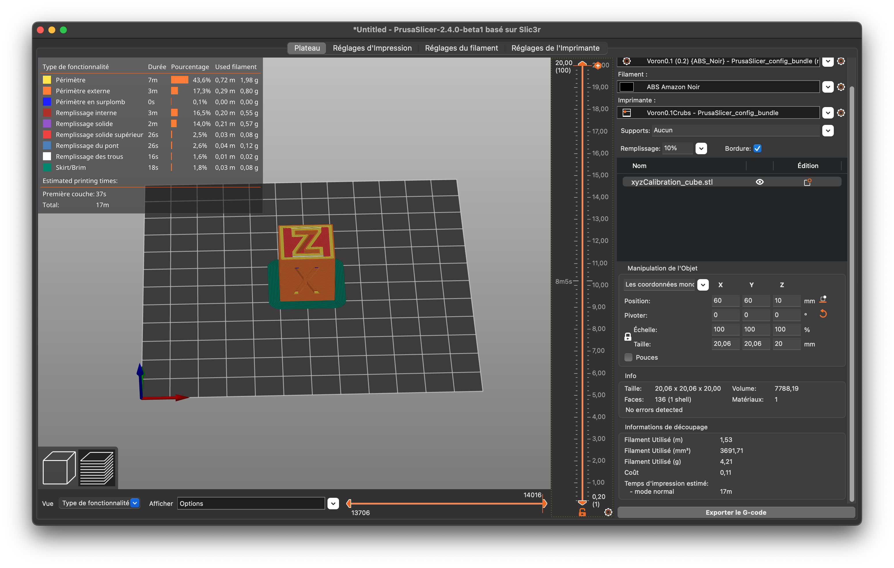

PrusaSlicer
===========

PrusaSlicer est un logiciel qui génère des fichiers *gcode* pour ensuite imprimer une pièce en 3D.
Ce logiciel est disponible gratuitement pour les principaux systèmes d'exploitation.
Il peut être téléchargé sur le `site de Prusa3D <https://www.prusa3d.com/fr/page/prusaslicer_424/>`_.

Récupération des configurations
===============================

Il est possible de récupérer des configurations existantes créées par d'autres personnes.
Pour récupérer celles pour les imprimantes du CRUBS, rendez-vous sur le Google Drive du CRUBS
puis naviguez jusqu'au dossier *Impression 3D* puis téléchargez les configurations.

.. code-block::

    CRUBS > Ressources > Impression 3D

Maintenant dans le logiciel PrusaSlicer, importez la configuration.

Une fois la configuration importée, il faut la sauvegarder. Pour cela, il faut se rendre dans chacun des trois onglets
de réglages puis cliquer sur la disquette pour enregistrer.
Il est nécessaire de changer le nom. Répétez l'opération pour les deux autres onglets de réglages.

.. note::

    Sans cette étape, il faudra importer la configuration à chaque démarrage du logiciel.

Génération d'un fichier gcode
=============================

Pour généré ce fameux fichier *gcode*, il faut enregistrer la pièce à imprimer au format *stl* ou *3mf*.
Dans SolidWorks, faites *enregistrer-sous* puis sélectionnez le bon format.

Pour importer la pièce dans PrusaSlicer, il suffit de faire un glisser-déposer du fichier.

Avec un clic de la souris, il est possible de changer le point de vue.

Pour modifier la position ou l'orientation de la pièce, il suffit de cliquer sur le bouton adéquat à gauche.
Veillez à ce que la pièce soit positionnée de la manière la plus stable et en évitant qu'il y ait des impressions
dans le vide.

Sur le panneau de droite, vous pouvez choisir de mettre des supports ou encore le remplissage de la pièce.

Une fois que tout est bon, cliquez sur la touche *tab* pour découper la pièce.
Des informations s'affichent désormais en haut à gauche et en bas à droite concernant l'impression.
Les sliders autour de la vue principale permettent de voir les étapes de l'impression.

Il n'y a plus qu'à exporter le *gcode* et à le mettre dans l'imprimante.
