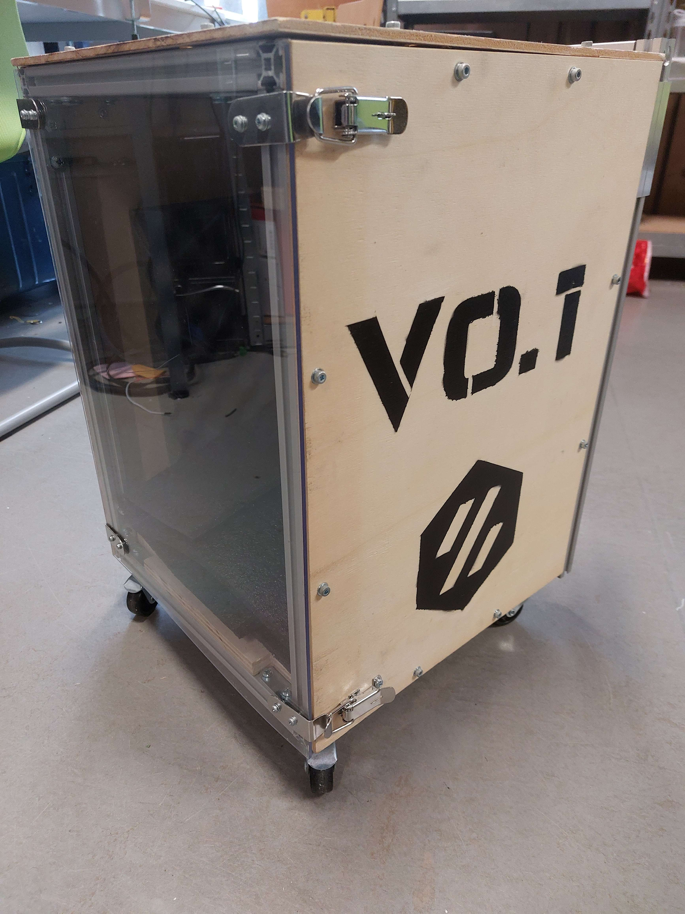
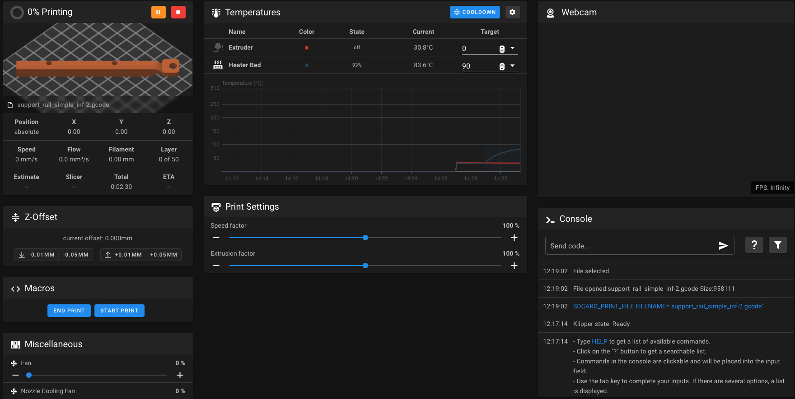

Introduction
============

L'imprimante 3D Voron0.1 est un projet communautaire opensource. Toutes les informations relatives à l'imprimante sont
disponibles sur le `site officiel de Voron <https://vorondesign.com/voron0.1>`_. C'est une imprimante de petite taille
et réputée pour sa vitesse et sa précision d'impression.

Voici une image de la Voron du CRUBS.

.. image:: images/voron/voron.jpg
   :scale: 10 %
   :align: center
   :class: with_shadow

Toutes les pièces rouges ont été imprimées en ABS et les autres pièces ont été achetées puis montées afin de donner
cette imprimante.

De par sa petite taille et avec sa caisse de transport, la Voron est un atout à emporter à
la coupe de France de robotique.

Utilisation
===========

Pour utiliser la Voron, il faut, comme pour toutes les imprimantes, préparer un fichier *gcode*. Au CRUBS,
nous utilisons le logiciel PrusaSlicer.

:doc:`/FAO/PrusaSlicer`

La Voron n'a pas d'interface utilisateur directe. Cependant, elle génère un réseau wifi auquel on peut se connecter
et accéder à une page web qui sert d'interface pour contrôler l'imprimante. En se connectant à la bonne adresse IP
depuis votre navigateur, vous accédez à la page principale de la Voron.

Depuis cette page, il est possible de gérer différents paramètres de la Voron en instantané.

Tout à gauche, vous avez l'onglet *G-CODE FILES* qui contient tous les fichiers gcode qui ont été importés.
Cette sur cette page que vous pouvez importer vos fichiers gcode et les lancer.

Les autres onglets ont une utilisation plus faible, je vous laisse donc regarder par vous-mêmes si vous en avez
la curiosité.

Maintenance
===========

La Voron est une imprimante qui nécessite, comme toutes les imprimantes, un certain niveau de maintenance.

Une grande majorité des pièces imprimées l'ont été en double en matériau ABS au cas où il y a casse
de l'une d'entre elle. Donc après remplacement de la pièce cassée, je vous invite fortement à ressortir cette pièce.
Toutes les pièces sont disponibles dans le dossier *Pieces_Voron* de l'onglet *G-CODE FILES*. Attention,
les fichiers gcode ne correspondent peut être pas pour le filament avec lequel vous voulez imprimer la pièce.
Dans ce cas, vous devrez recréer le gcode à partir de la CAO
(disponible sur le `site de Voron <https://vorondesign.com/voron0.1>`_).

Pour le démontage et le remontage de la Voron, je vous incite fortement à regarder le manuel d'assemblage, en effet,
le montage de la Voron est assez complexe.
