Coupe de France de robotique
============================

La coupe de France de robotique est le projet qui rassemble les membres du CRUBS. Chaque année, la compétition
est organisée par Planète Science à la Roche-sur-Yon sur le week-end de l'ascension.
Le sujet de la compétition change chaque année et est publié courant septembre.
Les équipes (généralement des clubs étudiant) ont ensuite jusqu'en mai pour réaliser le/les robot(s)
qui répondent au sujet.

Une fois sur place le/les robot(s) sont contrôlés par les arbitres pendant une phase d'homologation
qui dure du mercredi au vendredi pour s'assurer que ces derniers répondent aux exigences du réglement.

Une fois une équipe homologuée, elle peut participer au match. Les matches sont avec deux équipes qui s'affrontent,
les robots doivent alors marquer le plus de points possible. Ces matchs sont sans élimination et servent juste à classer
les équipes. Il n'est pas obligatoire pour les équipes de participer à tous les matchs.

Les 16 premières équipes du classement s'affrontent ensuite durant des matchs éliminatoires lors d'une phase finale
le samedi après-midi. L'équipe gagnante et la seconde de la coupe de France de robotique sont ensuite qualifiées
pour la coupe d'Europe qui se déroule de nouveau en match éliminatoire le samedi soir.

La compétition s'organise de la manière suivante :
- mercredi : arrivée des équipes et homologation.
- jeudi : match 1 & 2 et homologations.
- vendredi : match 3 & 4 et homologations.
- vendredi soir : "La coupe-off" (soirée étudiante trkl).
- samedi : match 5 et finales.

L'objectif pour le CRUBS est de participer chaque année à cette compétition qui rassemble les membres du club
autour d'un projet commun.

Organisation
============

Concernant l'inscription à la coupe de robotique, tout se passe sur le site de
`Poolzor de Planète science <https://www.planete-sciences.org/robot/poolzor/>`_

Il est possible de commander les repas en avance sur la plateforme Poolzor, un self et un bar sont présents à la coupe
afin de se nourrir. Par expérience, nous avons constaté qu'un "repas froid" (sandwich) le midi et un "repas chaud"
(au self) est un bon compromis argent/nutrition. Il est en général nécessaire de racheter de quoi grignoter
dans la journée. Une grande surface est accessible à pied à coté du lieu de la coupe.

Concernant le trajet, nous nous rendons en 3/4 voitures à la coupe de France. C'est suffisant pour transporter l'équipe
et beaucoup de matériel. Plusieurs choses présentes au club sont pratiques pour la coupe de robotique, la table pliante,
les tabourets pliables, la malle bleue, l'étagère noire démontable, la Voron dans sa caisse de transport.
Maintenant, s'il peut être possible un jour d'utiliser le mini-bus et sa remorque du SUAPS de l'UBS, ça pourrait
être pas mal :)

Pour l'hébergement plusieurs lieux ont été trouvé :

* Un mobil-home 5~7 place au `camping le Pavillon <https://www.campinglepavillon.com>`_ est suffisant. (3 lits simples + 1 lit double + 1 canapé-lit). Attention, il n'y a pas de duvet. Louer le camping du mercredi (16h) au dimanche matin (10h) est une bonne chose pour avoir le temps de se reposer un minimum avant de faire la route du retour. En revanche, il est nécessaire de faire un trajet de 25 minutes très soporifique pour rejoindre le camping et il faut vraiment s'y prendre en avance pour éviter des tarif exorbitants, la coupe ayant lieu sur le week-end de l'ascension.
* Un gîte 6 places à 15 minutes de la coupe :`Escale Clopinière 1 <http://escale.clopiniere.free.fr/>`_. Le gîte est suffisant 7~8 personnes avec un lit double et 4 lits simples. Le gîte est tout équipé avec une cuisine avec frigo, deux douches, deux salles de bain et deux toilettes. L'arrivée se fait le mercredi après-midi (16~17h) et le départ le samedi matin (10h) en laissant les clefs a l'intérieur. Bonne expérience.

Historique
==========

Édition 2023-2024 : Farming mars
********************************

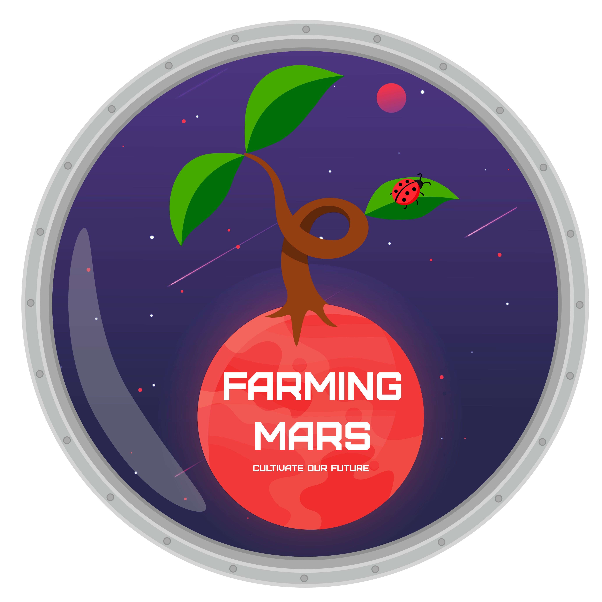

:doc:`/Robot-2024/Tree`

Objectifs : Fiabiliser les réalisations et aller plus loins

Les 4e années encore présentes à Lorient se sont rendues à la compétition, les 5A ont fait le déplacement depuis Paris et la Belgique. Nous étions 7 et nous avons logé dans un gîte très sympa à 15 minutes en voiture de la coupe : `Escale Clopinière 1 <http://escale.clopiniere.free.fr/>`_. Le robot n'a malheureusement pas pu être homologué pour le premier match et les deux PAMI ont été ajoutés à partir du 3e match.

X équipes présentes, X homologuées

* match 2 : 21 pts
* match 3 : 1 pts
* match 4 : 38 pts
* match 5 : 53 pts

Classement : 47ème 

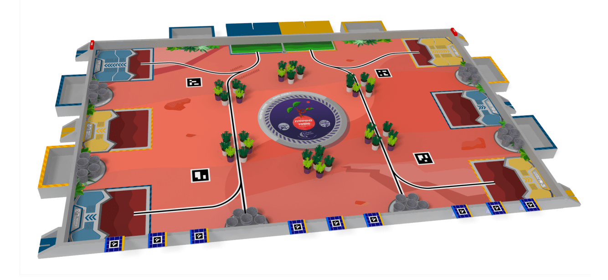

Édition 2022-2023 : The cherry on the cake
******************************************

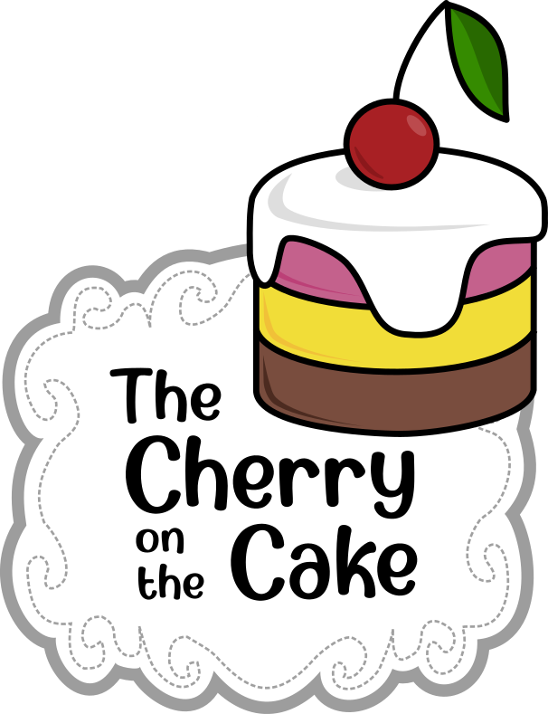

:doc:`/Robot-2023/Tree`

Objectif : Participer aux 5 matchs

Le club s'est rendu prêt à la compétition. Nous sommes partis à 9 en 4 voitures. Nous avons logé en mobil-home (7 places) dans le `camping Le Pavillon <https://www.campinglepavillon.com/>`_ à proximité de la Roche-sur-Yon. Nous sommes partis le mercredi matin et nous sommes repartis le dimanche matin.

92 équipes présentes, 81 homologuées

* match 1 : 31 pts
* match 2 : 39 pts
* match 3 : 21 pts
* match 4 : 21 pts
* match 5 : 51 pts

Classement : 43ème 

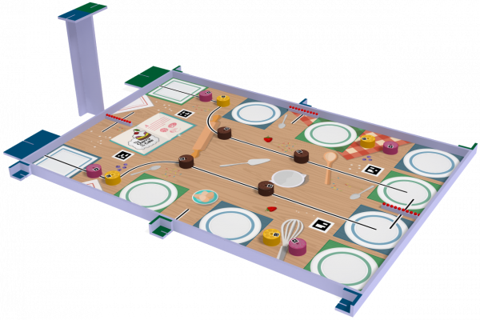

Édition 2021-2022 : Age of bots
*******************************

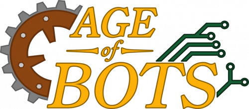

Objectif : Retourner à la coupe et s'homologuer

Le club s'est enfin rendu de nouveau à la compétition après plusieurs années. Le robot n'était pas tout à fait préparé et a réussi de justesse s'homologuer et participer à un seul match. Les roulements de sommeil se sont moyennement bien organisés, mais tout le monde survécu et on en garde quand même un bon souvenir de ce retour à la compétition.

? Équipe présentes, 66 homologués

* match 5 : 35 pts

Classement : 64ème

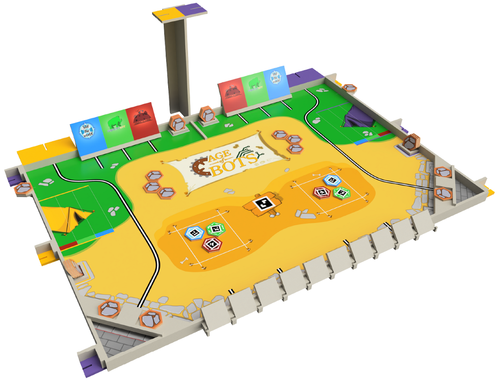

Édition 2020-2021 : Sail the world
**********************************

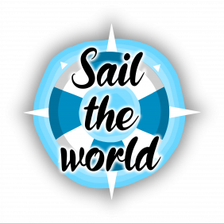

Le club avait très peu de membres cette année (quelques 5A) et n'a pas pu se rendre à la competition.

À l'issue des 2 années sur le sujet, des prototypes de base différentielle et de préhenseurs ont vu le jour.

L'organisation de la coupe de France a constaté à la suite de la compétition que beaucoup d'équipes on sévèrement pâtis du Covid-19, perte des connaissances des club, fermetures (pas de relève), etc.

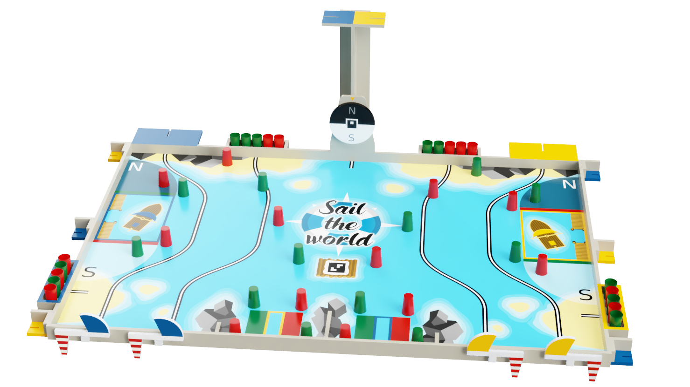

Édition 2019-2020  : Sail the world
***********************************

La compétition a été annulée pour cause de Covid et le sujet a été reporté à l'édition 2020-2021.

Édition 2018-2019 : Atom Factory
********************************

logo introuvable

Abandon, pas de participation de la part du club.

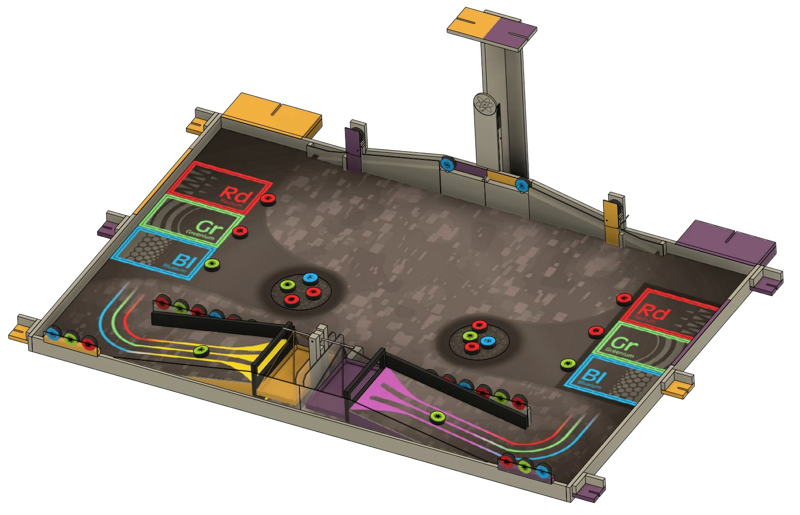

Édition 2017-2018 : Robot cities
********************************

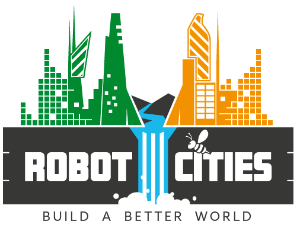

Sujet : Robot cities

Participation du CRUBS sous le nom d'équipe "Les pinalouest".

L'équipe ne semble pas avoir été homologuée, à vérifier.

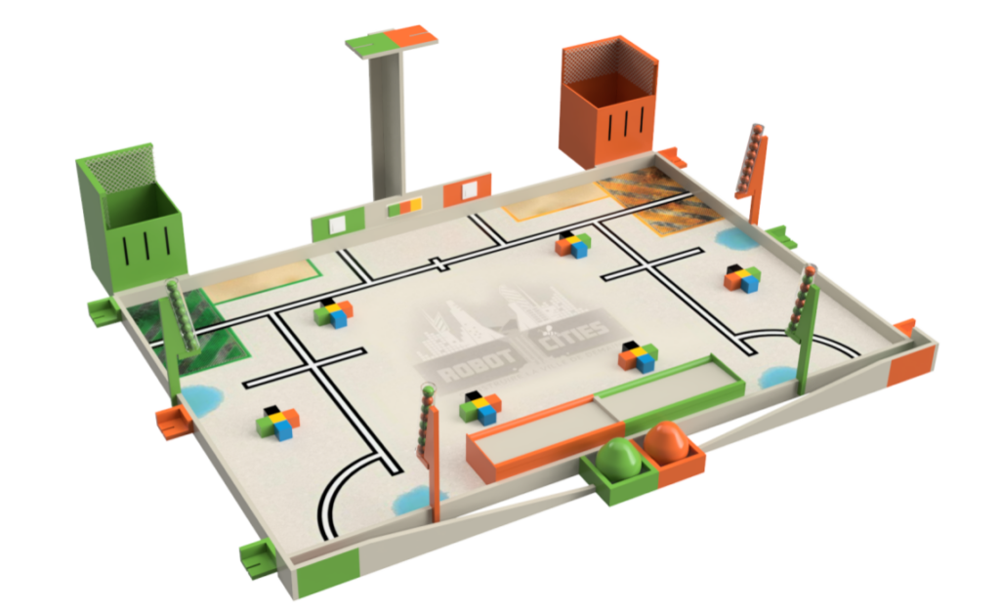

Édition 2016-2017 : Moon village
********************************

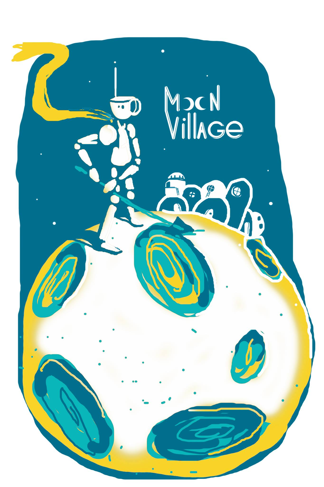

Participation du CRUBS sous le nom d'équipe "Les pinalouest".

? Équipe présentes, 142 homologués

4 machs joué pour un score total de 146

Classement : 83ème

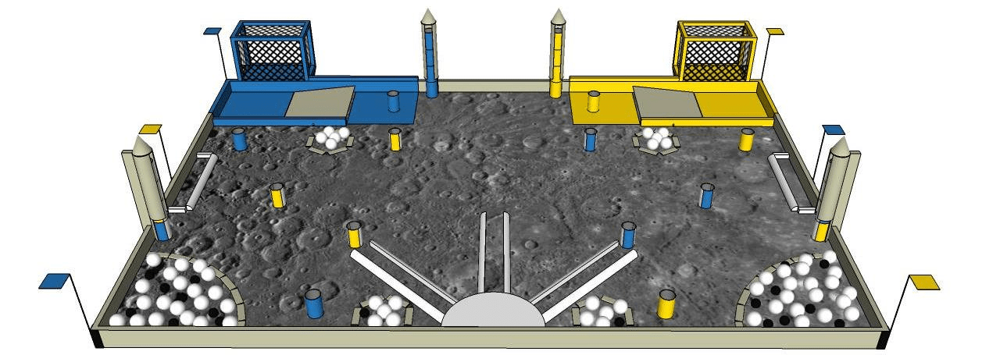