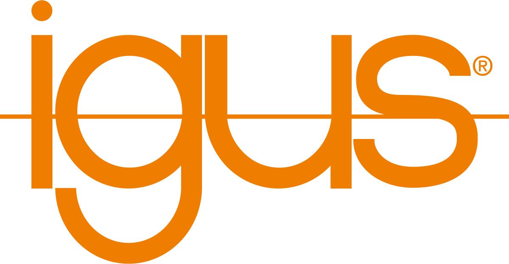

Partenariat et Subvention
=========================

Chaque année, le club a besoin d’argent en plus de l’inscription annuelle. Nous avons à partir des archives estimé
les besoins du club à 3 000 € par an uniquement pour la participation à la coupe de France de robotique.
Des frais supplémentaires s’ajoutent pour les consommables du club et d’autres besoins.

Dossier
*******

Le but est de rédiger un dossier chaque année présentant le club et nos projets. Expliquer pourquoi nous sommes
à la recherche d’un partenariat : la participation à la coupe de France de robotique. Donner une estimation du budget
nécessaire pour cette participation. Indiquer ce que nous et l’entreprise avons à gagner de ce partenariat et donner
les moyens de communication et ce que l’on peut leur offrir en échange de dons monétaire ou matériel.

École / BDE
===========

Historiquement, le club reçoit de l’argent de l’école, ce montant s’élève à 1000€. Suite à une énorme confusion
provenant du BDE qui pense que l’argent vient de leur financement, la subvention annuelle a été réduite à 500€
pour permettre aussi aux autres clubs de percevoir une subvention. Il est important de bien mettre au courant
chaque nouveau trésorier du BDE de ce financement en 2023-2024, le directeur de l’école change,
il est donc envisageable d’aller le voir pour se présenter et l’informer de cette subvention annuelle.

FSDIE
=====

.. image:: images/sub/fsdie.png
	:scale: 50 %
	:align: center

La FSDIE, *Fonds de Solidarité et de Développement des Initiatives Étudiantes*, permet de financer des projets
d’associations étudiantes de l’université dans des domaines variés : projets humanitaires,
activités culturelles ou sportives, animation du campus…

Un calendrier est mis à jour tous les ans avec les dates limites de dépôt des dossier et la date des conventions.

Le déroulement est le suivant : dépôt du dossier de financement avant la date limite présentation orale
devant un jury de notre association et de notre projet envoie de notre dossier à un jury qui valide (ou non)
notre demande.

Il y a plusieurs conditions à remplir pour déposer un dossier de financement auprès de la FSDIE :

* Être une association et présenter tous les documents nécessaires, ce n’est pas notre cas, mais nous pouvons déposer
un dossier au nom du BDE et utiliser leurs papiers.
* Pour les projets de plus de 500€ présenter un cofinancement du projet, donc une autre subvention d'une entreprise.
* Présenter un dossier complet selon leur modèle.
* À la fin du projet présenter un bilan moral et financier.

En présentant un projet au nom du BDE, nous pouvons ainsi toucher de l’argent pour la participation
à la coupe de robotique.

2022-2023
*********

Nous avons donc déposé un dossier à la FSDIE en fin 2022 et nous avons reçu le financement courant février 2023.
Nous avions présenté un projet nécessitant un budget de 3000 € et nous avions demandé à la FSDIE de financer 40%
de ce projet soit 1200 €. Nous avions en tant que cofinancement l’entreprise Coriolis Composites.

Le dossier présenté est ici sur le drive du club : https://drive.google.com/drive/u/0/folders/1kwcVIV-iy9JuzpI_yzn_k8ba-iMOJs_t

Coriolis Composites
===================

.. image:: images/sub/coriolis.png
	:scale: 120 %
	:align: center

Coriolis Composites develops, produces and commercializes robotic cells and value-added software for automated
composite additive manufacturing. Its strong expertise in composite technologies allows Coriolis Composites
to offer off-the-shelf and tailored solutions to your industry.

2022-2023
*********

Nous sommes allés voir l’entreprise en physique à Quéven en octobre, nous avons pris un rendez-vous pour présenter
notre projet à un employer qui a ensuite présenté ce projet lors d’un conseil. L’entreprise a accepté de
nous accompagner et de financer 40% de notre projet à 3000€. Nous avions ainsi notre cofinancement
pour le dossier de la FSDIE.

2023-2024
*********
Reprise de contact avec notre interlocuteur de l’année précédente, Ivan HARDY. Ce dernier nous réoriente
vers Matthieu DUPUIS cependant nous n'avons plus de nouvelle de l'entreprise depuis.

IGUS
====

IGUS est une entreprise spécialisée dans la réalisation de pièce mécanique plastique sans graisse.

2023-2024
*********
L’entreprise est venue durant l’été 2023 pour poser un *IGUS corner* au sein du club.
Ce présentoir est gratuit et renouvelé par l’entreprise tous les ans. L’objectif est de travailler avec IGUS afin
d’obtenir des échantillons permettant d’améliorer les robots. Cette année, nous avons pu obtenir des axes linéaire,
des paliers d'axe et des billes porteuses.
