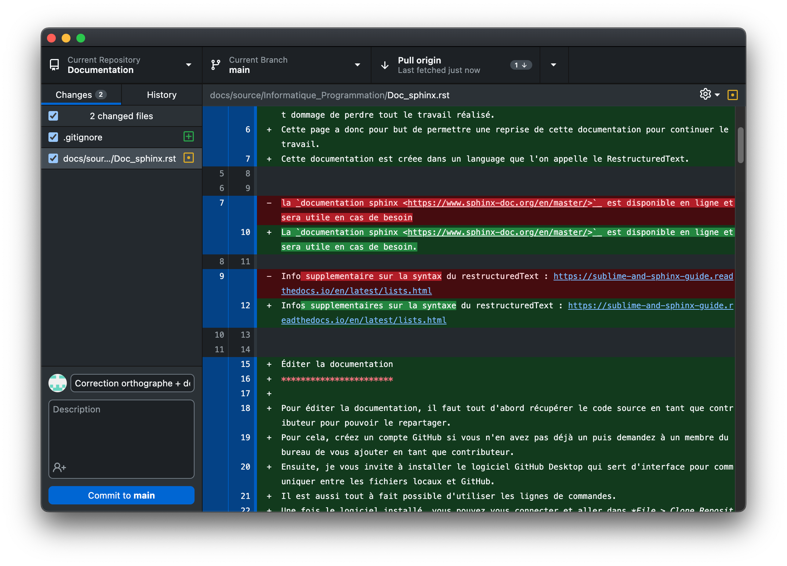

Introduction
============

Cette documentation a été commencée en 2022. L'objectif est de garder une trace du travail realisé par les membres du CRUBS entre 2021 et 2024. 
Ces 3 années ont été fructueuses avec un retour à la coupe de france de robotique et il serait dommage de perdre tout le travail réalisé. 
Cette page a donc pour but de permettre une reprise de cette documentation pour continuer le travail. 
Cette documentation est créee dans un language que l'on appelle le RestructuredText.

La `documentation sphinx <https://www.sphinx-doc.org/en/master/>`_ est disponible en ligne et sera utile en cas de besoin.

Infos supplementaires sur la syntaxe du restructuredText : https://sublime-and-sphinx-guide.readthedocs.io/en/latest/lists.html

Éditer la documentation
***********************

Pour éditer la documentation, il faut tout d'abord récupérer le code source en tant que contributeur pour pouvoir le repartager.
Pour cela, créez un compte GitHub si vous n'en avez pas déjà un puis demandez à un membre du bureau de vous ajouter en tant que contributeur.
Ensuite, je vous invite à installer le logiciel GitHub Desktop qui sert d'interface pour communiquer entre les fichiers locaux et GitHub. 
Il est aussi tout à fait possible d'utiliser les lignes de commandes.
Une fois le logiciel installé, vous pouvez vous connecter et aller dans *File > Clone Repository*. 
Normalement le logiciel devrait vous proposer le dépôt de la documentation. Vous pouvez ainsi le cloner sur votre PC. Vous pouvez aussi retrouver le dépôt sur le `GitHub du CRUBS <https://github.com/CRUBS/Documentation>`_.

Une fois le dépôt cloné, vous pouvez maintenant modifier la documentation.

Pour envoyer vos modifications sur le serveur, rendez-vous sur GitHub Desktop. 
Dans le panneau de droite, vous avez vos modifications qui sont indiquées, à gauche, les fichiers modifiés, en desssous, 
une zone de texte pour indiquer un résumé des modifications et en dessous un zone pour développer les modifications, si vous le souhaitez.
Ensuite cliquez sur *commit to main* puis *push*.

Pour récupérer des modifications depuis le serveur, cliquez sur *Fetch* puis *Pull*, sur le bouton en haut de la fenêtre.

Commencement
============

Installation
************

Windows
^^^^^^^

.. code-block:: bash

	pip install -U sphinx

linux (Debian / Ubuntu)
^^^^^^^^^^^^^^^^^^^^^^^

.. code-block:: bash

	apt-get install python3-sphinx

Génération
**********

Si vous souhaitez démarrer votre propre projet, vous pouvez utiliser la commande suivante :

.. code-block:: bash

	sphinx-quickstart

Cette étape n'est pas nécessaire si vous souhaitez simplement participer à la documentation du CRUBS.

Ordonancement des fichiers et des dossiers
******************************************

Index
*****

Compilation
***********
Pour ne pas toujours avoir besoin de push sur github vos modifications et attendre la mise à jour de la doc, il est possible de compiler cette dernière en local.

Vous pouvez récupérer les fichier make.bat et Makefile, disponible sur `github <https://github.com/CRUBS/Documentation/tree/main/docs>`_

Ajoutez ces fichiers à la racine des fichiers de la documentation (comme sur github) puis vous pouvez exécuter la compilation dans un terminal de la manière suivante :

.. code-block:: bash

	make html

De cette manière un dossier 'build' sera générer et vous trouverez dans ce dernier un fichier 'index.html', ouvrez-le avec votre navigateur web préfère et voilà !

Généralités
===========

Titres
******

.. code-block:: rst

	ceci est texte

	ici un titre principale
	=======================

	maintenant un titre secondaire
	******************************

	et enfin un titre tertiaire
	^^^^^^^^^^^^^^^^^^^^^^^^^^

Format de texte
***************

.. code-block:: rst

	texte en *italique*

texte en *italique*

.. code-block:: rst

	texte en **gras**

texte en **gras**

Liste et énumération
********************

Liste numerotée

.. code-block:: rst

	#. point 1
	#. point 2
	#. point 3

#. point 1
#. point 2
#. point 3

Liste à points

.. code-block:: rst

	* point 1
	* point 2
	* point 3

* point 1
* point 2
* point 3

Tableaux
********

Notes
*****

.. code-block:: rst
	
	.. note::
		ceci est une note

.. note::
	ceci est une note

Warnings
********

.. code-block:: rst

	.. warning::
		ceci est un warning

.. warning::
	ceci est un warning

Ajout de médias
===============

Attention les syntaxes sont à respecter imperativement, les tabulations, sauts de ligne, espaces, etc ...

Bloc de code
************

Exemple d'un bloc de code à ajouter à la page, vous pouvez evidement remplacer "python" par le langage que vous utilisez. 

.. code-block:: rst

	.. code-block:: python

		import math

		def main():
			print("Hello World !")

		if __name__ == "__main__":
			main()

Images
******

.. code-block:: rst

	.. image:: chemin/de/limage.png
	   :scale: 20 %
	   :align: center
	   :class: with_shadow float_right

Ici l'image est redimensionnée à 20% de sa taille originale, elle est alignée au centre de la page horizontalement. 
La ligne class, permet de la placer à droite de la page sans faire descendre le texte, ce que j'utilise pour les toctree de chaque sujet.

Beaucoup de paramètres existent dans la doc.

Hyperlien
*********

.. code-block:: rst

	`exemple de lien <page_web.html>`_

`exemple de lien <https://www.youtube.com/watch?v=dQw4w9WgXcQ>`_

Lien dans la documentation
**************************

.. code-block:: rst

	- :doc:`/Informatique_et_Programmation/Tree-Doc_sphinx`

:doc:`/Informatique_et_Programmation/Tree-Doc_sphinx`

