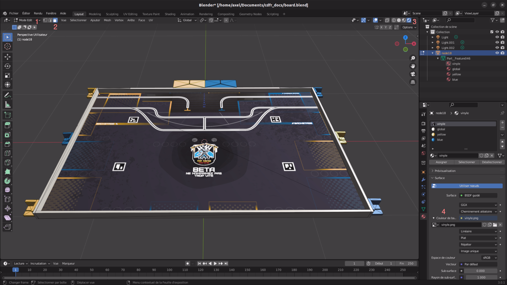

Créer le plateau en tant que monde Gazebo
=========================================

Préparation du modèle
*********************

Voici une série d'étape qui permettent d'afficher un monde avec une texture dans Gazebo.

Avant tout, un package ros va être créé.

.. code-block:: bash

    ros2 pkg create --build-type ament_cmake robot_gazebo

On y ajoute un dossier *models* et un dossier *worlds* pour y contenir les fichiers de simulation de Gazebo.

Un modèle *board* est à créer pour le plateau dans le dossier models.

.. code-block:: bash

    mkdir -p board/meshes

Il faut tout d'abord récupérer le modèle 3D du plateau au format STEP proposé par la coupe ainsi que le vinyle.

Ensuite, il faut convertir le fichier STEP en ficher DAE et le vinyle au format PNG. Ceci peut se faire via
divers sites qui proposent la conversion des fichiers.

La prochaine étape se fait dans le logiciel gratuit *blender* afin de mettre le vinyle sur le plateau.

Dans *blender*, importer le plateau et le tourner pour le mettre dans le plan **XY**. Pour ma part,
je place l'origine au centre du plateau.

.. tip::
    Pour faciliter les mouvements, il est possible de joindre les pièces en allant dans :code:`objet > joindre` après
    avoir sélectionné toutes les pièces du plateau.

Les textures vont désormais être appliquées pour obtenir ce résultat :

Pour avoir ce résultat, il faut passer en mode édition au niveau du **1** puis en mode sélection de face au niveau du
**2** et l'ombrage de vue en mode rendu au niveau du **3**. Sélectionner tout le plateau. Ensuite, dans le panneau de
droite et l'onglet matériau, on crée un matériau de type couleur à appliquer partout. Choisir la couleur et cliquer
sur *assigner*. Sélectionner la face du vinyle et créer un nouveau matériau et choisir *Texture Image* sur le point
jaune à côté du **4**. Choisir le vinyle et l'assigner. Le vinyle est désormais présent sur le plateau.

Il n'y a plus qu'à exporter au format DAE dans le dossier *meshes*.

Mise en place
*************

Des fichiers *model.config* et *model.sdf* sont à créer.

Voici le contenu du premier :

.. code-block:: xml

    <?xml version="1.0" ?>
    <model>
        <name>board</name>
        <version>1.0</version>
        <sdf version="1.7">model.sdf</sdf>
        <author>
            <name></name>
            <email></email>
        </author>
        <description></description>
    </model>

Et voici le contenu du second :

.. code-block:: xml

    <?xml version='1.0'?>
    <sdf version='1.7'>
        <model name='board'>
            <link name='link_0'>
                <pose>0 0 0 0 -0 0</pose>
                <gravity>1</gravity>
                <self_collide>0</self_collide>
                <kinematic>0</kinematic>
                <enable_wind>0</enable_wind>
                <visual name='visual'>
                    <pose>0 0 0 0 0 0</pose>
                    <geometry>
                        <mesh>
                            <uri>model://board/meshes/board.dae</uri>
                            <scale>1 1 1</scale>
                        </mesh>
                    </geometry>
                    <transparency>0</transparency>
                    <cast_shadows>1</cast_shadows>
                </visual>
                <collision name='collision'>
                    <laser_retro>0</laser_retro>
                    <max_contacts>10</max_contacts>
                    <pose>0 0 0 0 0 0</pose>
                    <geometry>
                        <mesh>
                            <uri>model://board/meshes/board.dae</uri>
                            <scale>1 1 1</scale>
                        </mesh>
                    </geometry>
                </collision>
            </link>
            <static>1</static>
            <allow_auto_disable>1</allow_auto_disable>
        </model>
    </sdf>

Il est possible de voir le rendu du plateau dans Gazebo dans l'onglet *insert* du panneau de gauche et en ajoutant le
chemin jusqu'au dossier *models*.

.. tip::
    S'il se passe des choses inattendues ou que le plateau n'apparait pas, lancez Gazebo en mode verbose afin d'avoir
    les logs :code:`gazebo --verbose`.

Il n'y a plus que le fichier de monde à créer. Ce fichier a l'extension *world* est situé dans le dossier *world*
(non impératif) et a le contenu suivant :

.. code-block:: xml

    <sdf version='1.7'>
        <world name='default'>
            <include>
                <pose>0 0 0 0 0 0</pose>
                <uri>model://board</uri>
            </include>
            <model name='ground_plane'>
                <static>1</static>
                <link name='link'>
                    <collision name='collision'>
                        <geometry>
                            <plane>
                                <normal>0 0 1</normal>
                                <size>10 10</size>
                            </plane>
                        </geometry>
                        <max_contacts>10</max_contacts>
                    </collision>
                    <self_collide>0</self_collide>
                    <enable_wind>0</enable_wind>
                    <kinematic>0</kinematic>
                </link>
            </model>
            <light name='spot_top' type='spot'>
                <pose>0 0 10 0 0 0</pose>
                <diffuse>1 1 1 1</diffuse>
                <specular>0.1 0.1 0.1 1</specular>
                <direction>0 0 -1</direction>
                <attenuation>
                    <range>20</range>
                    <constant>0.05</constant>
                    <linear>0.01</linear>
                    <quadratic>0.001</quadratic>
                </attenuation>
                <cast_shadows>0</cast_shadows>
                <spot>
                    <inner_angle>0.6</inner_angle>
                    <outer_angle>1</outer_angle>
                    <falloff>1</falloff>
                </spot>
            </light>
        </world>
    </sdf>

Plus qu'à tester : :code:`gazebo my_world.world`.

.. warning::
    Pour utiliser des modèles créés depuis n'importe quelle localisation, il faut ajouter le chemin dans les chemins
    à chercher par Gazebo dans chaque terminal depuis lequel on veut lancer le monde. :code:`source
    /usr/share/gazebo/setup.sh` puis :code:`export GAZEBO_MODEL_PATH=$GAZEBO_MODEL_PATH:path/to/my/directory/models`

Ajouter des éléments
====================

Ajouter des éléments sur le plateau se fait de la même manière que pour ajouter le plateau.

Si une unique couleur suffit pour le modèle, un fichier STL peut être mis dans le dossier *meshes* et cette ligne est
à ajouter au SDF dans la balise *material* :code:`<ambient>1 1 1 1</ambient>` avec le code couleur RGBA entre 0 et 1.

Pour les formes les plus simples, il est plus pratique de les créer depuis Gazebo :code:`Edit > Model Editor` puis
créer la forme aux dimensions souhaitées. Pour éditer la pièce, il suffit de double cliquer dessus. En quittant
l'éditeur de modèle, sauvegarder puis les fichiers *model.config* et *model.sdf* sont créés.

Finalement, il n'y a plus qu'à inclure le modèle dans le monde de la même manière que le plateau.
