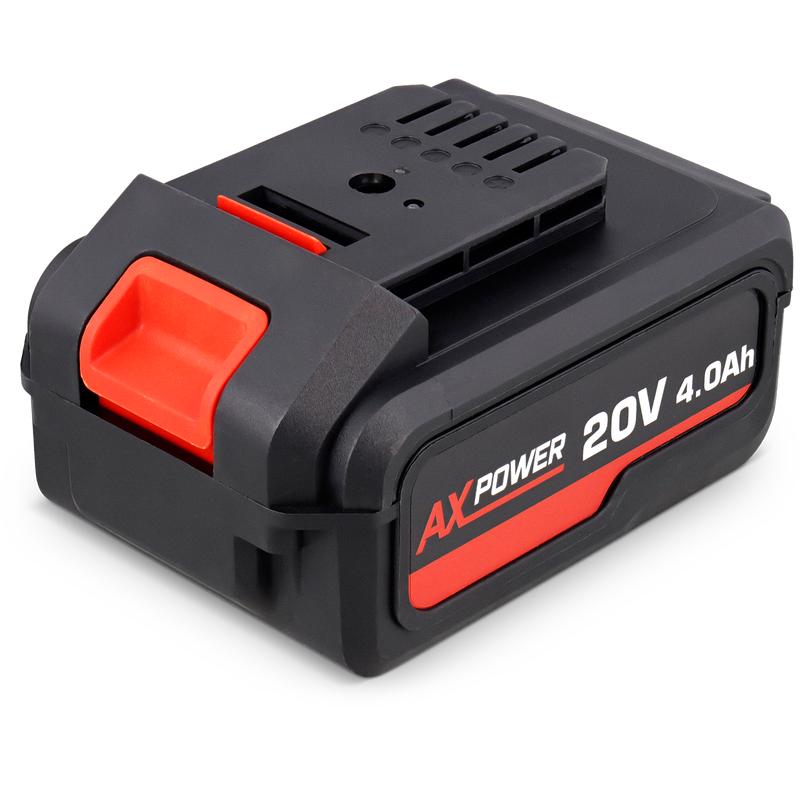
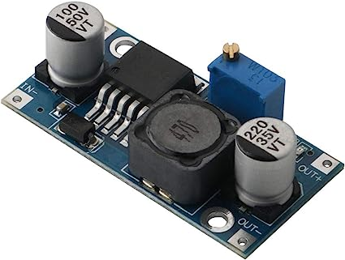
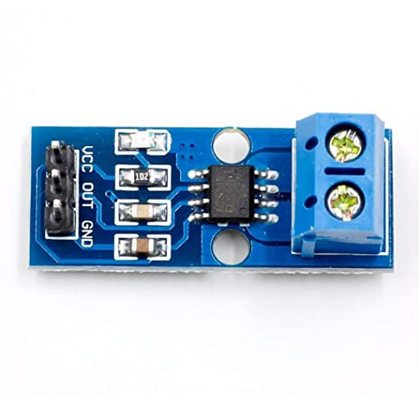
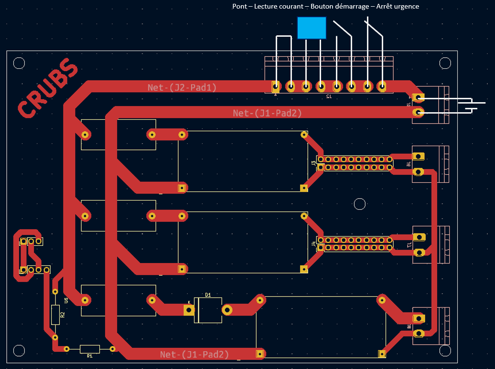

Source d'alimentation
=====================

Après une mauvaise experience avec les batteries LIPO deja presente au club, nous avons fait le choix de changer
de source d'alimentation pour les robot. Nous nous sommes inspiré de ce que nous avons pu voir lors
de la coupe de france de robotique et nous avons opté pour des batterie de perceuse.
Toujours dans le but de faire des économies, nous avons acheté celles disponibles chez Action.

Afin de récupérer l'énergie des batteries nous avons créé notre propre adaptateur pour la batterie.

Nous asssurons desormais d'avoir une source d'energie fiable, facilement et rapidement rechargeable.

Carte d'alimentation
====================

Conversion
**********
Le robot est composé de plusieurs types de carte et de composant ces derniers sont soit alimentés en 5V, 7V ou 12V,
nous avons donc besoin de reduire la tension de la batterie à ces differentes tensions dont nous avons besoin.
Il existe plusieurs moyen de réduire la tension, les régulateurs de tension linéaires type L7805CV en sont capables,
en revanche ces derniers ne sont pas réglables et ne surportent pas toujours les besoins en courant.
Nous nous somme tournés vers une autre solution, les buck-converter type lm2596,
ces derniers surportent les gros courants et la tension de sortie peut être réglée ce qui est un bon avantage
si on souhaite changer l'un des niveaux de tension ou s'en reservir sur d'autres projets.

Nous avons besoin de convertir avec une limite de 5A pour le moteurs en 12V,
les modules de 3A suffiront pour le 5V et le 7V.

.. image:: images/alimentation/buck_5a.png
   :scale: 35 %
   :align: center

Protection
**********

Trois types de protection on été ajoutées à la carte d'alimentation.

La premiere est un simple bouton d'arrêt d'urgence qui est ajouté en série de l'alimentation.
Le réglement de la compétition oblige la présence d'un bouton d'arret d'urgence d'un diamètre d'au moins 20mm.
Par ailleur, ce dernier nous permet d'arrêter rapidement le robot en cas de problème, le bouton d'alimentation
étant difficile à atteindre (mais joli).

La seconde est une protection contre les court-circuits, un fusible a été ajouté en amont de chaque de buck-converter.
Ce dernier fondera dans le cas d'un courant suppérieur à la capacité du buck converter pour les protéger
ou d'un courant excessivement grand dans le cas d'un court-circuit pour limiter les dégats sur le reste du systeme.

Enfin la dernière protection est un diode anti-retour placée en amont du buck-converter qui alimente
les moteurs des roues. En effet, les moteurs pas à pas agissent comme génératrice lorsque le robot est hors tension
et que l'on bouge ce dernier, la tension générée est alors renvoyée dans la carte d'alimentation,
traverse dans le mauvais sens le buck converter 12v puis part alimenter les deux autres convertisseur.
Cela a pour effet de faire booter en sous alimentation la Pi et les autres cartes Arduino, ce qui n'est pas bon
pour ces cartes. Pour palier à ça, la diode d'anti-retour empêchera la tension générée de poursuivre son chemin
après avoir traversé le buck converter de 12V et n'alimentera donc pas le reste du circuit.

Attention les moteur pas à pas consomment beaucoup de courant, la diode anti-retour doit être correctement
dimensionnée, dans notre cas, la diode résiste à 6A.

Mesure de Tension
*****************

La tension de la batterie est image de son niveau de charge, en effet, cette derniere délivre une tension de 20.5V
à pleine charge et descend jusqu'à 16.5V avant d'arrêter de deélivrer du courant.
Nous avons donc besoin d'un retour du niveau de tension de la batterie.
Pour cela, nous mettons en place un pont diviseur de tension d'un rapport de 5 avec une résistance de 10K et 40K,
ainsi la tension aux bornes de la résistance de 10k est 5x inférieure à celle de la batterie et évoluera
donc entre 4.1V et 3.3V. cette tension peut être mesurée par un port analogique de l'Arduino Uno avant
d'être remontée par liaison série à la Pi pour être publié sur un topic et affiché sur l'ezran LCD pour
nous permettre de surveiller l'état de la batterie.

Mesure du Courant
*****************

Afin de nous assurer que le courant consommé par le robot est correct, nous avons fait le choix d'intégrer
un module de mesure du courant, le ACS712. Le module en question est ajouté en série de l'alimentation sur la carte.
Une fois la mesure relevée par l'Arduino Uno, cette dernière est ensuite renvoyée par liaison série à la Pi
afin de l'afficher sur l'écran LCD et de le publier sur les topic ROS2.

Le module de mesure de courant s'est avéré être très compliqué à lire, instable et inutile.
Ce module ne sera pas à conserver.

Le pcb a été designée grâce à *KiCad* et a été réalisé sur la CIF.

- :doc:`/CAO/Tree-KiCad`
- :doc:`/FAO/Tree-CIF`

Le schéma électrique
********************

.. image:: images/alimentation/Schema.png
   :scale: 100 %
   :align: center

Le PCB
******

