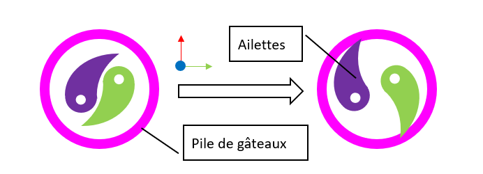
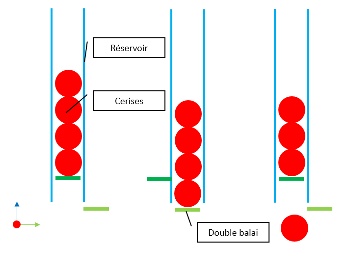
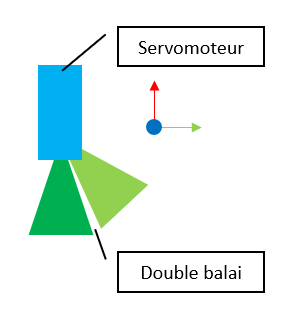

Introduction
============

Objectifs
*********
Le robot n°1 sera le principal, il aura pour but de :

#. Faire les gâteaux.
#. Mettre les cerises préchargées sur les gâteaux.
#. Mettre les roues dans le plat, à la fin du service.
#. Se déguiser pour faire la fête.
#. Calculer l’addition.

Architecture
************

Choix d'une base holonome à 4 roues de 58mm. 4 roues pour conserver le code de l'année précédente,
le développement révélera malheureusement qu'il est nécessaire de revoir le code.

Les différents préhenseur montés sur les élévateurs seront montés dans les espaces vides entre chaque branche
de la base holonome.

Stratégie CdFR
==============

Stratégie utilisée et déplacement séquentiel choisis pour les matchs à la CDFR.

Déplacement
===========

Roue
****

.. image:: images/robot1/roue_holonome.png
   :scale: 30 %
   :align: center

Roues holonomes pour la base holonome, achat sur aliexpress.
2 rangées de 5 rouleaux, 58mm de rayon

https://fr.aliexpress.com/item/4001228422666.html?spm=a2g0o.order_list.order_list_main.31.21ef5e5bDfrTIG&gatewayAdapt=glo2fra

Motorisation
************

Utilisation des moteurs pas à pas, car déjà une expérience.

Plus d'info:

- :doc:`/Robot-2023/Tree-Motorisation`

Actionneurs
===========

Élévateur
*********

Un des objectifs de cette année était de tester un mécanisme du robot. Le but est de réutiliser cette partie
du robot tous les ans sans avoir à le refaire : L'élévateur. Chaque année le sujet de la coupe implique d'avoir
à lever un objet pour le déplacer, le rôle de l'élévateur sera de faire ce mouvement vertical et seul un préhenseur
qui se monte dessus devra être de nouveau travaillé chaque année.

Cette année 3 élévateurs ont été monter sur le premier robot pour soulever les piles de gâteaux.

.. image:: images/robot1/schema_elevateur.png
   :scale: 60 %
   :align: center

Après une année avec ce système, ce dernier nécessite quelques modifications, mais le principe est concluant
et peut être réutilisé sur les futurs robots.

Préhenseur des piles
********************

Pour attraper les piles génoises, crème et de glaçage nous avons développé une préhenseur qui se monte
sur les élévateurs.

Le but de ce préhenseur est d'insérer deux ailettes dans les trous au centre des piles et
d'écarter ces deux ailettes pour exercer une pression sur les parois du trou. L'élévateur permettra d'attraper
les piles à différentes hauteurs pour attraper 1, 2 ou 3 éléments pour ainsi reconstituer les gâteaux
avec la bonne recette.

.. image:: images/robot1/schema_prehenseur.png
   :scale: 70 %
   :align: center

Par manque de temps nous n’avons pas pu utiliser les actionneurs à leur plein potentiel.
Nous les avons réduits à une simple tige métallique qui plonge au centre des piles et qui traîne les piles
en même temps que le robot se déplace.

Dépose des cerises
******************

Pour marquer plus de points, il est possible de poser une cerise par gâteaux.
Un actionneur supplémentaire a donc été ajouté sur le côté restant du robot.

Cartes
======

Raspberry pi 4
**************

Fait tourner ROS2 pour faire fonctionner le robot, communique avec les autres cartes.

Arduino Mega et ramps1.6
************************

Une Arduino méga équipée d'un shield *ramps 1.6* est utilisé uniquement pour le contrôle des moteurs,
cette dernière reçoit ces ordres par liaison série de la Pi.

Arduino Uno
***********

Une Arduino uno est utilisé pour contrôler les servomoteurs et pour lire les valeurs des différents capteur et sonde.
Dans son cas elle recevait les ordres des servomoteurs de la Pi et envoyait les données de l'imu,
de tension et de courant à cette dernière.
