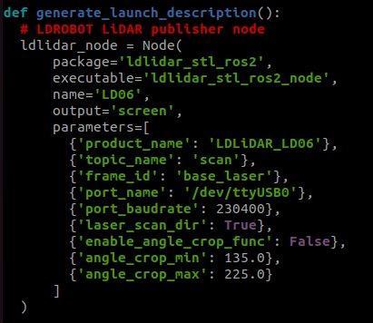

Introduction
============

Afin de permettre aux robots de repérer leur environnement et principalement les robots adversaires,
plusieurs solutions existent. Après avoir observé des résultats trop imprécis avec les prototypes des balises,
nous avons dû nous rabattre sur la solution la plus couteuse qui est l'achat de deux lidars.
Nous avons sélectionné les LD06, ces derniers sont déjà utilisés dans le domaine de la robotique et par des équipes
de la coupe de France. De plus, tous les packages ROS2 existent pour ce dernier.

Câblage
=======

Un module de conversion ttl vers série est nécessaire afin de connecter le lidar à la Pi en USB (ref : CP2102).
Voici le câblage :

#. lidar pin 1 : blanc : tx -> module ttl : rx
#. lidar pin 2 : jaune : pwm -> N/A
#. lidar pin 3 : rouge : gnd -> module ttl : gnd
#. lidar pin 4 : bleu : 5v -> module ttl : 5v

Installation
============

Tuto vidéo suivi : https://www.youtube.com/watch?v=OJWAsV6-0GE

Création d'un workspace avant de télécharger les paquets :

.. code-block:: bash

	mkdir -p ldlidar_ros2_ws/src
	cd ldlidar_ros2_ws/src

Puis copie d'un répertoire git.

.. code-block:: bash

	git clone https://github.com/ldrobotSensorTeam/ldlidar_stl_ros2.git
	cd ~

Vous pouvez désormais brancher le lidar et vérifier avec la commande suivante le nom de son port USB.

.. code-block:: bash

	ls /dev/ttyUSB*

.. image:: images/lidar/port_name.png
   :scale: 100 %
   :align: center

Notez bien le numero du port USB, dans mon cas /dev/ttyUSB0/

Ajoutons lui les droits.

.. code-block:: bash

	sudo chmod 777 /dev/ttyUSB0

Nous allons maintenant modifier le fichier de launch du lidar afin de lui indiquer le port sur lequel ce dernier
est connecté.

.. code-block:: bash

	cd ~
	cd ldlidar_ros2_ws/src/ldlidar_stl_ros2/launch
	nano ld06.launch.py

Maintenant trouvez la ligne suivante et modifiez-la en fonction du port USB utilisé par le lidar, dans mon cas
le /dev/ttyUSB0  est déjà indiqué par défaut à la ligne 45.

.. code-block:: python

	'port_name': '/dev/ttyUSB0'

Une fois la modification effectuée, pour pouvez fermer et enregistrer le fichier avec ctrl+x puis y.

À l'avanir, le nom du port USB utilisé sera fixé en tant que '/dev/Lidar_LD06' (se referer au tuto dans
la configuration Ubuntu).

:doc:`/Robot-2023/Tree-Configuration_Ubuntu`

Lancement du lidar
==================

Maintenant que le package du lidar est correctement configuré, nous allons pouvoir le faire fonctionner
afin de visualiser notre environnement.

Nous devons compiler le package puis sourcer les variables d'environnement.

.. code-block:: bash

	cd ~
	cd ldlidar_ros2_ws
	colcon build
	source install/setup.sh
	source ~/.bashrc

Nous pouvons enfin lancer le noeud du lidar.

.. code-block:: bash

	ros2 launch ldlidar_stl_ros2 ld06.launch.py

dans un nouveau terminal vous pouvez verifier que le topic */scan* est bien present.

.. code-block:: bash

	ros2 topic list

Visualisation du lidar
======================

Lancer le lidar comme vu au dessus puis lancement de rviz.

.. code-block:: bash

	rviz2

En bas à gauche de la fenêtre, cliquer sur *Add* puis dans le volet qui vient de s'ouvrir, choisir *LaserScan* et *Ok*.

Vous allez maintenant devoir sélectionner plusieurs paramètres du menu de gauche.

#. dans Global Options > Fixed Frame choisir base_link
#. dans LaserScan > Topic choisir /scan

Des points de couleurs devraient apparaitre dans l'interface centrale de rviz représentant les éléments captés
par le lidar.

