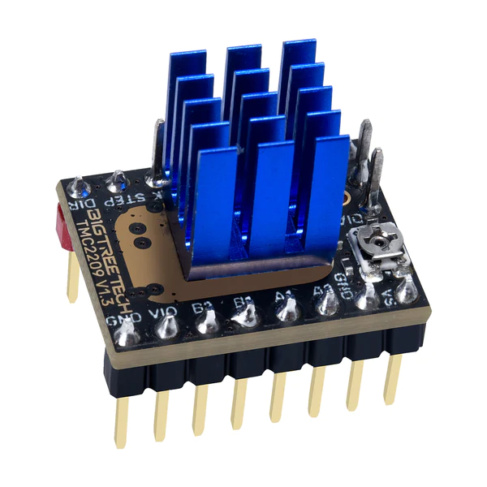

Introduction
============

Afin de piloter les roues des robots, nous avons fait le choix d'opter pour des moteur pas à pas (Néma 17 2 phases).
Ces derniers ont la possibilité d'être facilement utilisables à partir d'une carte Arduino équippée d'un shield
pouvant accueillir jusqu'à 5 drivers de moteurs pas à pas. Le tout forme ce que l'on appelle une RAMPS.
C'est un systeme beaucoup utilisé dans le domaine des imprimantes 3D.

.. image:: images/motorisation/ramps16.png
	:scale: 45 %
	:align: center

Principe de fonctionnement des Némas
************************************

.. image:: images/motorisation/nema_pos.png
	:scale: 80 %
	:align: center

https://www.youtube.com/watch?v=jPTvo6boZkk

https://www.youtube.com/watch?time_continue=0&v=eyqwLiowZiU&embeds_referring_euri=https%3A%2F%2Faccu-components.com%2F

Pilotage des moteurs
====================

Une fois branché sur une ramps, les Némas peuvent facilement être pilotés par l'Arduino, le tout est de savoir comment.

#. EN : le pin enable permet d'alimenter le moteur, en général un niveau 0 alimentera le moteur et un niveau 1 le coupera
#. DIR : ce pin permet simplement de définir le sens du moteur selon le niveau logique du pin
#. STEP : ce pin est le plus important, ce dernier va piloter la vitesse de rotation du moteur. À partir de l'envoi d'un signal carré, chaque période de ce signal permettra d'effectuer un micro pas
#. MS0, MS1, MS2 : ces pins du drivers vont permettre de choisir le nombre de micro pas à ajouter au Néma. Le control du niveau logique de ces derniers ne se fait pas par l'Arduino mais mais des cavaliers qui se trouvent sous chaque drivers. Pour savoir le nombre de micro pas choisis il faut se réferer à un tableau qui est propre à chaque driver. Placer un cavalier correspond à un niveau logique 1
#. A1, A2, B1, B2: sont les sorties, ces pins vont directement piloter le bobinage des Némas.

La solution qui est la plus simple à mettre en oeuvre reste de créer une boucle qui inverse l'état du pin de sortie
selon une certaine période tel que :

.. code-block:: arduino

	void setup() {
		pinMode(13, INPUT);
	}

	void loop() {
		digitalWrite(13, !digitalRead(13));
		delayMicroseconds(100);
	}

Cette methode à l'avantage d'être tres simple à mettre en oeuvre mais reste très gourmande en temps
pour un microprocesseur. Ainsi cette methode reste très bien dans le cas du clignotement d'une led à basse fréquence,
mais pour générer un signal carré à haute fréquence cela risque de poser probleme.
En effet, dès que l'on ajoute plusieurs moteurs avec cette méthode, la vitesse maximale pouvant être atteinte
diminue et un programme plus complet peinera à effectuer le reste de ces intructions. Par ailleurs,
il n'est pas non plus garanti que le délais soit respecté et la période de notre signal de sortie risque
d'être fortement impactée.

Pour éviter cela, il existe une autre solution, l'utilisation des interruptions.

Les interruptions
=================

Afin de piloter les moteurs de manière très précise, nous allons donc utiliser les interruptions. Les interruptions
utilisent les timers, ces derniers correspondent à un compteur mais à l'avantage de ne pas être impacté par le niveau
d'utilisation du processeur. En d'autres termes, même si le programme est lourd en calcul, le timer continuera
de s'incrémenter avec la fréquence du processeur.

C'est là que les interruptions interviennent. Cette dernière est une fonction qui sera executée au moment où
un timer aura atteint la valeur voulue. Ainsi, nous allons pouvoir générer un signal carré en inversant l'état
d'un port Arduino à chaque fois que le timer atteint la valeur souhaitée, et en faisant varier cette valeur,
nous allons pouvoir changer la fréquence de ce signal carré.

Selon les microprocesseurs, les timers sont codés sur un certain nombre d'octets, ainsi lorsque l'on veut
se servir d'un timer il faut faire attention à ce que notre période puisse être comptée. Il existe une solution
dans le cas où la valeur maximale ne peut pas être atteinte : les pré-scalaires. Il faudra donc attendre
qu'un premier registre du timer atteigne la valeur du pré-scalaire avant d'incrémenter de un le registre du timer
de l'interruption. Nous pouvons ainsi compter bien plus loin.

Voici comment mettre en place une interruption sur le timer 3 avec Arduino :

.. code-block:: arduino
	
	pinMode(36, OUTPUT); //création d'un port témoin pour lire le signal
	volatile int period = 10000; //création de la période variable

	void setup() {

		noInterrupt(); //désactivation des interruptions le temps de travailler dessus
		TCCR3A = 0; //reset du registre A du timer 3
		TCCR3B = 0; //reset du registre B du timer 3
		TCCR3B |= B00000001; //écriture dans le registre B du timer 3 pour définir qu'il n'y a pas de pré-scaler
		TCNT3 = 0; //remise à 0 du compteur
		OCR3A = period -1; //création de la valeur de comparaison

		TIMSK3 |= (1 << OCIE3A); // on allume l'interruption sur la comparaison du timer

		interrupts(); et on fini par réallumer les interruptions
	}

	//ici la fonction de l'interruption, elle sera exécutée à chaque fois que la comparaison entre
	//la valeur de OCR3A et celle du timer sera égale
	ISR(TIMER3_COMPA_vect){
		digitalWrite(13, !digitalRead(13)); //inversion du pin 13 pour faire tourner le moteur

  		OCR3A = period-1; // on réetablie la valeur de comparaison par sécurité
		TCNT3 = 0; //on remet le compteur à 0
	}

	// la variable period peut être modifiée pendant l'évolution du programme
	//cela peut se faire directement dans la boucle loop ou dans une fonction via un message ROS ou série par exemple.
	//cela se fait en insérant le block suivant:
	noInterrupts();
	period = newval;
	OCR3A = period - 1;
	interrupts();

Il suffit maintenant de dupliquer la partie présente dans le setup et le l'interruption en ramplaçant les 3
par le numéro de celui que vous souhaitez utiliser. De cette manière, chaque moteur fonctionnera sur son interruption.

.. warning::
    Attention, toute les cartes Arduino ne possèdent pas les mêmes timers. Dans le cas d'une Arduino mega,
il y a 4 timers 16 bits ainsi le moteur 1er est contrôler par le timer1, le 2nd par le timer3,
le 3eme par le timer4 et enfin le 4eme moteur par le timer5.

!!!!!! confli servo.h !!!!!!!
*****************************

.. danger::

	La bibliothèque *servo.h* utilise les timers afin de piloter des servomoteurs. À la compilation vous aurez
	donc une erreur indiquant la sur-utilisation d'un vecteur. Il est donc nécessaire de modifier la bibliotheque
	pour que cette dernière n'utilise pas le timer que nous utilisons.

	Pour cela dirigez-vous dans votre dossier d'installation d'Arduino IDE. Pour moi *arduino-1.8.19*. Suivez ensuite
	le chemin suivant:
	arduino-1.8.19 > libraries > Servo > src > avr

	Ouvrer ensuite le fichier *ServoTimers.h*, trouvez ensuite les lignes suivantes qui correspondent à votre processeur,
	ici pour un Arduino mega :

	.. code-block:: cpp

		// Say which 16 bit timers can be used and in what order
		#if defined(__AVR_ATmega1280__) || defined(__AVR_ATmega2560__)
		#define _useTimer5
		#define _useTimer1
		#define _useTimer3
		#define _useTimer4
		typedef enum { _timer1, _timer3, _timer4, _timer5, _Nbr_16timers } timer16_Sequence_t;

	Nous allons devoir désactiver l'utilisation de notre timer. Pour cela, on retire tout simplement ce qui mentionne
	notre timer 3 tel que :
	(cette action est évidemment applicable pour tous les timers qui devraient être utilisés par des interruptions)

	.. code-block:: cpp

		// Say which 16 bit timers can be used and in what order
		#if defined(__AVR_ATmega1280__) || defined(__AVR_ATmega2560__)
		#define _useTimer5
		#define _useTimer1
		#define _useTimer4
		typedef enum { _timer1, _timer4, _timer5, _Nbr_16timers } timer16_Sequence_t;

	Nous pouvons maintenant rouvrir ArduinoIDE et recompiler sans encombre notre programme/

