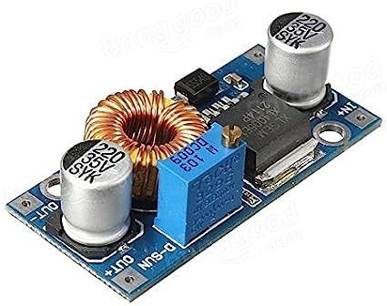
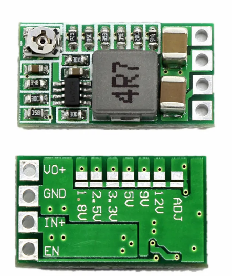

Introduction
============

La carte d'alimentation realiser jusque la est certe fonctionelle mais est tres encombrante. il est maintenant necessaire de passer a l'etape au dessus et de realiser une carte d'alimentation plus professionelle. nous allons reduire la carte de la carte en utiliser des cms et en regroupant les composant. il serait bon que cette carte ne soit pas a refaire chaque année et qu'elle soit suffisement polyvalente pour repondre a tous les besoins pouvant se presenter

la realisation de cette nouvelle carte fait l'objet d'un projet lors de l'année 2023-2024

Sources d'alimentation
======================

Batterie
********

Apres une bonne experience avec les baterie de perceuse. Nous concervons cette source d'alimentation pour les futurs robots

Afin de recuperer l'energie des batterie nous avons creer notre propre adapteur pour la batterie

nous asssurons desormais d'avoir une source d'energie fiable, facilement et rapidement rechargeable

.. image:: images/alimentation/batterie.png
   :scale: 30 %
   :align: center

Alim externe
************

Nous faisons desormais en sorte que le robot puisse ettre alimenter par une alimentation externe (les alim de stabilisé de labo) pour ne pas vider les baterie de perceuse inutilement

Choix de l'alim
***************

Le robot pouvant etre alimenter soit par une batterie soi par une alim externe, nous rajoutons un interupteur permettant de selectionner la source d'alimentation

.. ajouter la carte 

Carte d'alimentation
====================

Conversion
**********

Le robot est composer de plusieurs type de carte et de composant ces derniers sont soit alimenter en 3.3V, 5V, 9V ou 12V, nous avons donc besoin de reduire la tension de la baterie a ces differents dont nous avons besoin. il existe plusieurs moyen de reduire la tension, les regulateur de tension lineaire type L7805CV feront l'affaire pour alimenter des composants peut gourmant en energie. en revanche ces derniers ne sont pas reglable est ne surporte pas toujours les besoins en courant. Il existe un second type de regulateur, les hacheurs, ces derniers fonctionnent sur le meme principe que les pwm pour abaisser la tension. ils ont l'avantage de supporter une grosse demande en courant. on utilisera aisi des lm2596 et des mini dc-dc. Les mini dc dc que nous avons choisis ont la particularité de permettre de fixer la tension de sortie ou de la regler grace a une soudure au dos du composant

Protection
**********

Entre nous ... on fout une diode 6 Ampère avant la carte d'alimentation et c'est protegé non ? Et comme on est motiver on rajoute un fusible rearmable par sortie et un fusible 5A en entrée de la carte pour la forme :)

Niveau de la batterie
*********************

La tension de la batterie est image de son niveau de charge, en effet cette derniere delivre une tension de 21V a pleine charge et descent jusqu'a 16.5V avant d'arreter de delivrer du courant. nous avons donc besoin d'un retour du niveau de tension de la batterie.
Cette année nous decidons de changer pour afficher directement le niveau de la batterie sur la carte d'alimentation. a l'aide d'un composant, le lm3914n permet d'alimenter ou jusqu'a 10 led en fonction d'une tension qui varie sur une plage voulue

Réalisations
============

La carte comporte donc :

* le connecteur l'entree de tension
* le connecteur pour le bouton d'alimentation
* le connecteur pour l'arret d'urgence notez que l'arret d'urgence ne coupe pas la pi et l'esp 32
* la retour d'une niveau de batterie
* un buck converter 12V 5A pour les 3 sortie moteurs
* un buck converter 5V 5A pour la PI (non coupé par l'AU)
* un buck converter 9V 3A pour l'esp32 (non coupé par l'AU)
* deux buck converter 5V 3A pour 2*10 sorties
* un buck converter 9V 3A pour 10 sorties
* un buck converter 3.3V 3A pour 10 sorties
* un buck converter 12V 3A pour 10 sorties

Le shema electrique
*******************

Le PCB
******

