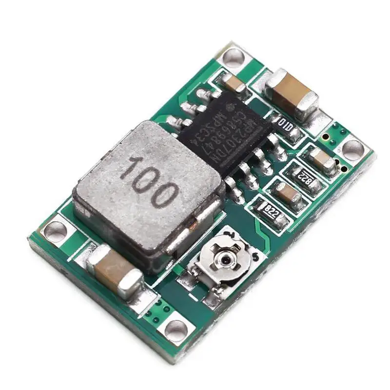

Introduction
============

La carte d'alimentation réalisée jusque la est certe fonctionelle mais est tres encombrante. il est maintenant nécessaire de passer a l'etape au dessus et de realiser une carte d'alimentation plus professionnelle. Nous allons réduire la carte de la carte en utiliser des cms et en regroupant les composant. il serait bon que cette carte ne soit pas a refaire chaque année et qu'elle soit suffisement polyvalente pour repondre a tous les besoins pouvant se presenter

la realisation de cette nouvelle carte fait l'objet d'un projet lors de l'année 2023-2024

Sources d'alimentation
======================

Batterie
********

Apres une bonne experience avec les baterie de perceuse. Nous concervons cette source d'alimentation pour les futurs robots

Afin de recuperer l'énergie des batterie nous avons creer notre propre adapteur pour la batterie

nous asssurons desormais d'avoir une source d'énergie fiable, facilement et rapidement rechargeable

.. image:: images/alimentation/batterie.png
   :scale: 30 %
   :align: center

Alim externe
************

Nous faisons desormais en sorte que le robot puisse ettre alimenter par une alimentation externe (les alim de stabilisé de labo) pour ne pas vider les baterie de perceuse inutilement

Choix de l'alim
***************

Le robot pouvant etre alimenter soit par une batterie soi par une alim externe, nous rajoutons un interupteur permettant de selectionner la source d'alimentation

.. ajouter la carte 

Carte d'alimentation
====================

Conversion
**********

Le robot est composer de plusieurs types de carte et de composant ces derniers sont soit alimenter en 3.3V, 5V, 9V ou 12V, nous avons donc besoin de réduire la tension de la batterie a ces différents dont nous avons besoin. il existe plusieurs moyens de réduire la tension, les régulateurs de tension linéaires type L7805CV feront l'affaire pour alimenter des composants peut gourmand en énergie. En revanche ces derniers ne sont pas réglables est ne supporte pas toujours les besoins en courant. Il existe un second type de régulateur, les hacheurs, ces derniers fonctionnent sur le même principe que les PWM pour abaisser la tension. Ils ont l'avantage de supporter une grosse demande en courant. On utilisera aussi des lm2596 et des mini buck-converter. 

.. image:: images/alimentation/buck_5a.png
   :scale: 35 %
   :align: center

Protection
**********

Entre nous ... on fout une diode 6 Ampères avant la carte d'alimentation et c'est protégé non ? Et comme on est motivé, on rajoute un fusible réformable par sortie et un fusible 5A en entrée de la carte pour la forme :)

Niveau de la batterie
*********************

La tension de la batterie est image de son niveau de charge, en effet cette dernière délivre une tension de 21V à pleine charge et descend jusqu'à 16.5V avant d'arrêter de délivrer du courant. Nous avons donc besoin d'un retour du niveau de tension de la batterie.
Cette année nous décidons de changer pour afficher directement le niveau de la batterie sur la carte d'alimentation. à l'aide d'un composant, le lm3914n permet d'alimenter ou jusqu'a 10 LED en fonction d'une tension qui varie sur une plage voulue

Réalisations
============

La carte comporte donc :

* le connecteur l'entrée de tension
* le connecteur pour le bouton d'alimentation
* le connecteur pour l'arrêt d'urgence notez que l'arrêt d'urgence ne coupe pas la PI et l'ESP32
* le retour d'un niveau de batterie
* un buck converter 12V 5A pour les 3 sorties moteurs
* un buck converter 5V 5A pour la PI (non coupé par l'AU)
* un buck converter 9V 3A pour l'esp32 (non coupé par l'AU)
* deux buck converter 5V 3A pour 2*10 sorties
* un buck converter 9V 3A pour 10 sorties
* un buck converter 3.3V 3A pour 10 sorties
* un buck converter 12V 3A pour 10 sorties

Le schéma électrique
********************

Le PCB
******

