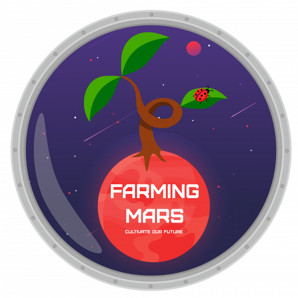
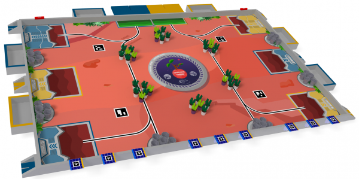

Sujet
=====

L’espace, frontière de l’infini vers laquelle voyage notre vaisseau spatial, notre première étape est : Mars.
Mais si on arrive à l’heure du déjeuner, comment allons-nous faire pour nous sustenter ? Après tout,
les gâteaux de mémère Monique ont tous été mangés l’an passé !

C’est pourquoi nos robots ont une mission très importante pour la bonne réussite de notre voyage : préparer le terrain
et faire des réserves de nourriture ! Ou plus exactement, faire en sorte que la serre autonome déjà mise en place
survive assez longtemps pour que nos astronautes puissent récolter des fruits et légumes, et ainsi survivre
et continuer leur long voyage !

Génoise, crème, glaçage et sans oublier la fameuse cerise, voilà de quoi cuisiner pour réjouir Grand-mère
Monique. À vos cuillères !

Ces missions seront :

#. Rempoter les plantes et les mettre en culture,
#. Orienter les panneaux solaires pour que la serre ne perde pas d’énergie,
#. Assurer la pollinisation des plantes.
#. Réorienter les panneaux solaires. 
#. Retourner se recharger les batteries, à la fin de la journée de travail
#. Anticiper le futur rendement de la récolte.

Choix
=====

Généralités
***********

Cette année, seule la conception d'un unique robot est autorisée. En revanche, les PAMIs
(Petit Automate Robotisé Indépendant) font leur entrée en scène.

Nous mettrons la priorité à la réalisation du robot principal et finir la navigation autonome avant de commencer
à réaliser le reste.

Préhenseurs
***********

Le robot sera équipé des élévateurs conçus l'année dernière. L'objectif et de garder le principe de l'élévateur
du préhenseur et de simplement changer l'outil de préhension en s'adaptant au sujet de cette année.

Alimentation
************

Carte d'alimentation plus professionnelle, CMS, miniaturisation, ajout d'un niveau de batterie. Réalisation de la carte
par une entreprise locale ou en ligne.

- :doc:`/Robot-2023/Tree-Alimentation`

Motorisation
************

Changement complet de la motorisation du robot, on essaie de passer sur les moteurs DC avec encodeur le tout fourni
par Éric SENN. Pour le pilotage, réalisation d'une carte par moteur, ce dernier est asservi en vitesse en local
grâce à l'encodeur. En entrée la commande (vitesse et sens) et en sortie la vitesse de rotation du moteur.

- :doc:`/Robot-2023/Tree-Motorisation`

Détection d'obstacles
*********************

Conservation du lidar pour la détection des robots ennemis. Nous apportons quelques modifications.

- :doc:`/Robot-2023/Tree-Lidar` du robot 2023
- :doc:`/Robot-2024/Tree-Lidar` du robot 2024

Nécessité de rajouter un autre moyen de détection proche du sol pour détecter les PAMIs, lasers ? Infrarouge ?
Ultrasons ?

Robot principal
===============

- :doc:`/Robot-2024/Tree-ArchiRobot`

Objectifs
*********

Le robot n°1 sera le principal, il aura pour but de :

#. Ramasser les plantes.
#. Ramasser les pots.
#. Rempoter les plantes dans les pots.
#. Réorienter les panneaux solaires. 
#. Prévoir les futures récoltes (prévision des points).

Architecture
************

En prévision du sujet de cette année, deux modélisations de robots ont été préparées en avance. Une base différentielle
et une base holonome à 3 roues. Il nous faut choisir une géométrie entre ces deux dernières. Les ascenseurs ayant
prouvé leur efficacité, ces derniers sont pour l'instant conservés sur les bases.

Indéfinie

PAMI (Petit Actionneur Mobile Indépendant)
==========================================

Les PMI font leur retour à la coupe de France de robotique, maintenant sous le nom de PAMI. Ces derniers sont des
modules d'une taille supérieure à un cube de 60 mm de côté et une hauteur inférieure à 150 mm.

- :doc:`/Robot-2024/Tree-ArchiPAMI`

Objectifs
*********

Les PAMIs auront pour but de :

#. Rentrer dans les zones de cultivation.
#. Polliniser les plantes.

Architecture
************

Indéfinie

