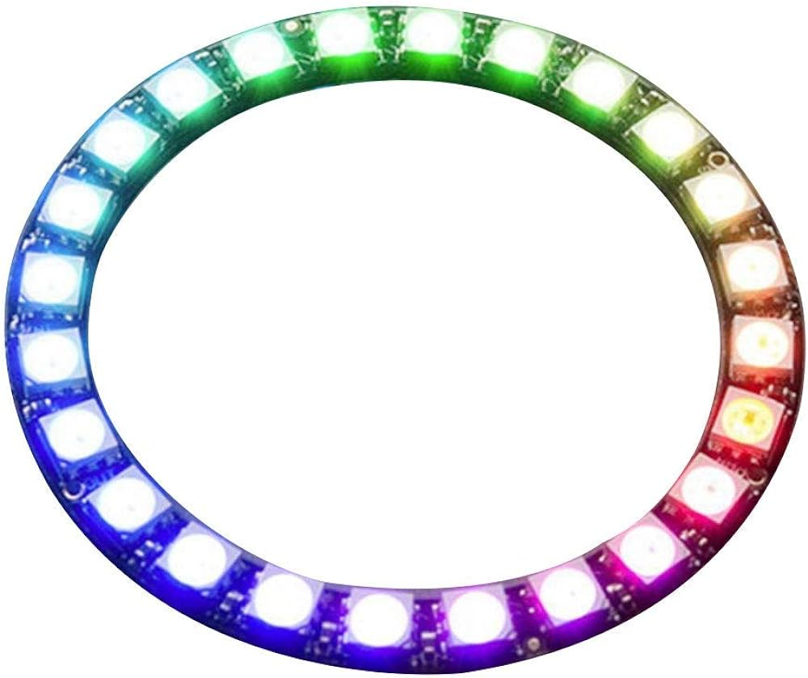

Introduction
============

Cette page est dédiée aux améliorations du mât de repérage du robot et donc du lidar. Je vous renvoie vers l'article
concernant les informations du lidar (installation, référence, etc.) :

:doc:`/Robot-2023/Tree-Lidar`

Pendant l'édition 2023 de la coupe, nous avons eu plusieurs idées permettant d'amélioration le mât :

#. Ameliorer la fixation du mat du lidar au robot
#. Hauteur de la plateforme dédiée à l'équipe adverse réglable
#. Cacher le socle du lidar, car ce dernier ne scan pas
#. Ajouter un cercle de LED autour du lidar et coder une visualisation des informations perçues par le lidar sur ce cercle.

Ces 3 points font l'objet d'un projet pour l'année 2023-2024

Améliorations
=============

Structure
*********

Concernant la fixation du lidar nous avons decider realiser un emboitement avec des aimant. un cercle avec des aimant est present sur le robot et un autre dans le mat avec des aiamnt dans le meme sens. nous avons fait en sorte qu'une paire d'aimant soit dans le sens inverse des autre afin de creer un detrompeur pour mettre le mats dans le bon sens

**TODO iamge**

dans la partie haute du mat une piece principale pour fixer le lidar, l'anneau led et 3 inserts. La platforme superieur contient 3 vis, qui vont dans les inserts de la partie principale, de cette maniere il est possible de regler la hauteur de la partie principale en tournant les vis

**TODO image**

LEDs
****

La référence des LEDs est un anneau de WS2812b, ce sont des LEDs "adressables", des LEDs RGB dont on peut contrôler
la couleur individuellement.

Ce genre de ruban LED peut normalement être commandé par une Raspberry, mais après beaucoup de temps passé dessus, nous n'avons pas réussi depuis Ubuntu 22.04 (alors que nous avons réussi sur Raspbian). Nous faisons donc le choix de piloter les LEDs depuis l'ESP32 et les informations du lidar seront transmises de la PI à l'esp32 sur le bus I²C.

